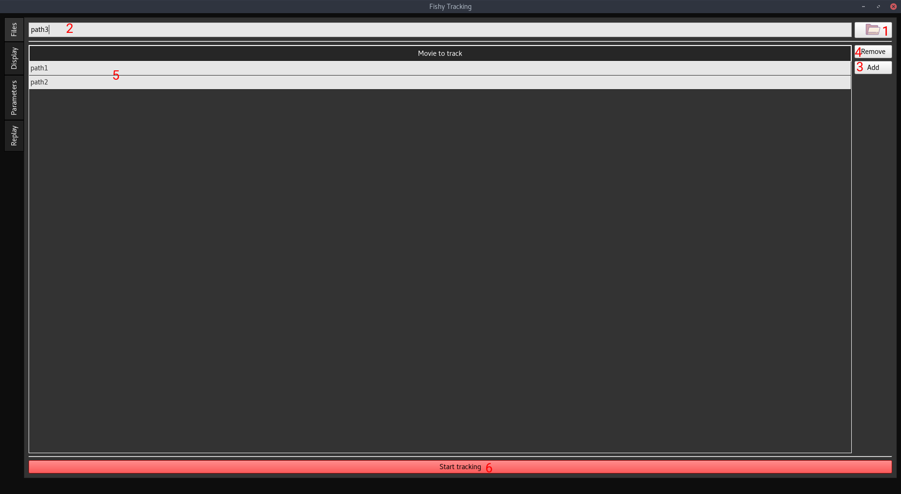
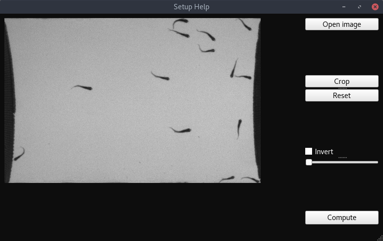
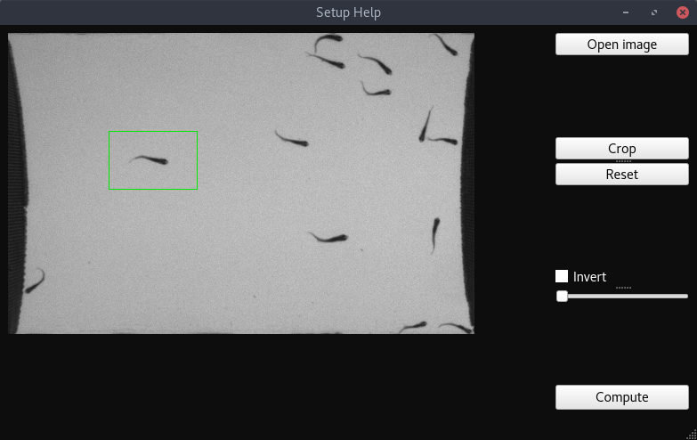
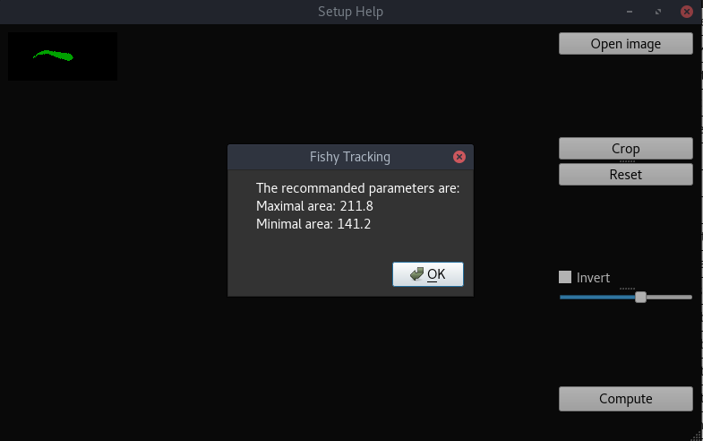
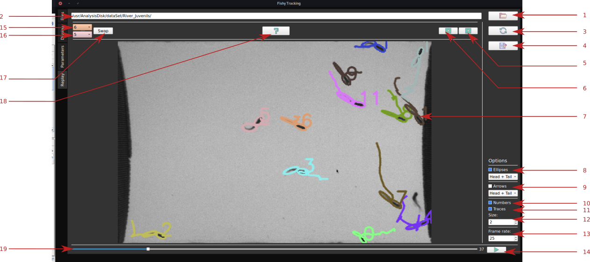
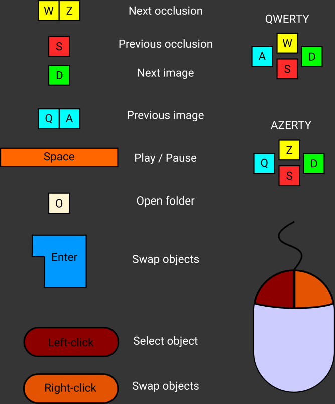

# User Manual

[TOC]

## General information

Fishy Tracking is an application that allows the user to track multiple animals in video recording. The application takes a sequence of images and outputs a folder with the tracking data, the parameter used to produce the data and a log file. Fishy Tracking can operate on Linux, Mac, and Windows systems.

The software provides to the user an automatic tracking and a facultative manual review of the tracking where errors can be corrected easily on-the-fly.

## Getting started

### Download

Stable versions of Fishy Tracking are released for Linux (AppImage file), MacOs (dmg file) and Windows (installer). Development version is accessible from source and can be compiled for every system.

1. Stable versions
   - Download the installer for your system at http://fishytracking.benjamin-gallois.fr/download.html.
2. Development versions
   - Install OpenCV 4 on your system by following instructions at https://docs.opencv.org/4.0.0/df/d65/tutorial_table_of_content_introduction.html.
   - Install Qt5 on your system by following instructions at http://doc.qt.io/qt-5/gettingstarted.html#offline-installation.
   - Download Fishy Tracking code source at https://git.benjamin-gallois.fr/bgallois/FishyTracking.
   - Referred to the developer user guide to compile the project.

### Installation

1. With Fishy Tracking installer:

   - Executes the installer and follows instructions. 

2. With Linux AppImage:

   Allows FishyTracking.appimage to be executed:

   - Right click on the AppImage file.
   - Click on properties.
   - Click on permissions.
   - Check "allow executing the file as a program".

3. With MacOs dmg file:

   - Drag the application from the dmg file window into /Applications. 

##  Software overview

### Files panel

The files panel allows the user to add paths to folders where the image sequence to analyze are stored. Multiple paths can be added to analyze data in a bunch.

How to add image sequences to analyze?

1. Add the path to the folder where the image sequence is stored:
   - Click on the (1) button to select a folder or copy the folder path to (2) the path bar.
2. Click on the (3) button to add the path to the list of movie to analyze (5).
3. Remove a path if necessary by selecting it in the (5) path table list and by clicking on the (4) button to remove the path.
4. Start the analysis by clicking on the (6) button start. 

### Display panel

The display panel shows the current analysis processus by displaying the binary image (1) and the tracking image (2). The tracking can be extremely fast, to review the tracking please referred to the replay panel.

### Parameters panel

The parameters panel provides a mean to change the tracking parameters before or during analysis. We recommend finding a set of parameters by changing parameters one by one and controlling effects in the display panel. When an optimal set of parameters are found, restart the analysis.
An interactive help to determine some parameters is available by clicking on the help button (1).

All parameters are saved and reloaded at each closing and opening of the program.

| Parameter                   | Range                                        | Description                                                  |
| --------------------------- | -------------------------------------------- | ------------------------------------------------------------ |
| Dilatation                  | 0 to inf                                     | Dilates detected objects. Sets to 0 for not dilatation.      |
| Registration                | yes, no                                      | Registers images.                                            |
| Light background            | yes, no                                      | yes: dark objects on light background, no: light object on dark background |
| ROI bottom y                | 0 to image height                            | 0: no ROI. y-coordinate of the bottom right corner of the rectangle ROI. |
| ROI bottom x                | 0 to image width                             | 0: no ROI. x-coordinate of the bottom right corner of the rectangle ROI. |
| ROI top y                   | 0 to ROI bottom y                            | 0: no ROI. y-coordinate of the top left corner of the rectangle ROI. |
| ROI top x                   | 0 to ROI bottom x                            | 0: no ROI. x-coordinate of the top left corner of the rectangle ROI. |
| Number of images background | 1 to number of images in the image sequences | Number of images to average to compute the background. The images are taken at equal interval in the image sequence. |
| Arrow size                  | 2 to inf                                     | Size of the arrow displayed on the object in the tracking image in the display panel. |
| Maximal occlusion           | 0 to inf                                     | Maximal distance in pixels that an object can travel when occluded. |
| Weight                      | 0 to 1                                       | Weight between difference in displacement or difference in direction to compute the cost (see matching method). |
| Maximal angle               | 0 to 360                                     | Angle in degree that an object can change between two frames (see matching method). |
| Maximal length              | 0 to inf                                     | Length that an object can travel between two frames (see matching method). |
| Spot to track               | 0, 1, 2                                      | 0: head, 1: tail, 2: body. Body part parameters (position and angle) used for the matching process (see matching method). |
| Binary threshold            | 0 to 255                                     | Threshold value that separate background and foreground.     |
| Minimal size                | 0 to maximal size                            | Minimal size in pixels of the tiniest object to track in the image sequences. |
| Maximal size                | minimal size to inf                          | Maximal size in pixels of the biggest object to track in the image sequences. |
| Object number               | 1 to inf                                     | Number of object to track.                                   |

#### Help parameter panel

An semi-automatic help is provided to help the user to setup the size of the tracked objects. Open the Setup Help window by clicking the (1) help button.

- Open an image by clicking on the Open image button.

- Select a typical object by clicking and dragging the mouse to enclose the object in the green rectangle.
- Click on the Crop button to crop the image.

- Threshold the object by displacing the slider.
- Tick/untick the Invert tick-box to have a white object on black background.
- Click on the Compute button to display the recommended maximal and minimal area parameters.

### Replay panel

The replay panel allows the user to open and see the result of a tracking analysis and to correct the tracking if errors are detected.

#### Open a tracking analysis

1. Clicks on the (1) button to open a folder where an image sequence previously analyzed is stored.
2. The image sequence is displayed in the (6) screen and can be played by clicking on the (5) button or by moving the (7) cursor. The frame rate can be chosen with the (7) box.
3. You can change display options with (2) tick-boxes.

#### Correct errors

To correct a tracking error (mismatching between two objects):

1. Get to the frame where the error occurs:
   - By playing the image sequence and visually identify errors.
   - By clicking on (4) buttons to go to previous and next occlusion events where mismatching are the most probable to occurs.
2. Left click on the first object or select the number of the first object in the (3) box. The box displays the number and the color of the selected object.
3. Left click on the second object or select the number of the second object in the (3) box. The box displays the number and the color of the selected object.
4. Right click on the (6) image or click on the (3) swap button to swap the two objects from the image displayed to the end of the image sequence.

#### Save tracking movie

The result of the tracking can be saved by selecting the display options (2) and the frame rate (8) and by clicking the (8) button. The movie is saved in .avi container with the MJPEG codec.

In case of error, check that you have the MJPEG codec available on your system.

#### Correct rapidly a tracked image sequence

Mouse and keyboards shortcuts are provided to rapidly correct a tracked image sequence.

For AZERTY keyboard:

- Next image: Z
- Previous image: S
- Next occlusion: Q
- Previous occlusion: D
- Play: Space

For QWERTY keyboard:

- Next image: W
- Previous image: S
- Next occlusion: A
- Previous occlusion: D
- Play: Space

Mouse shortcuts:

- Left click to select objects.
- Right click to swap objects.

## Input files

Fishy Tracking analyzes image sequence. "pgm", "png", "jpeg", "jpg", "tiff", "tif", "bmp", "dib", "jpe", "jp2", "webp", "pbm", "ppm", "sr", "ras", "tif" image formats are supported.

If you have recording in a video format, you need to convert it into image sequence.

1. For Linux, Windows, and MacOs in command lines:
   - Install ffmpeg.
   - In a terminal type: ffmpeg -i video.webm image-%03d.png
2. For Linux, Windows, and MacOs in graphical:
   - Use Handbrake: https://handbrake.fr/ or ImageJ.

## Output files

When an analysis is started, Fishy Tracking creates a folder named Tracking_Result containing:

- tracking.txt containing the tracking data (in the frame of reference of the full image with the origin in the top left corner) as following:

  | xHead                              | yHead                              | tHead                       | xTail                              | yTail                              | tTail                       | xBody                              | yBody                              | tBody                       | Curvature           | ImageNumber            | headMajorAxisLength                                          | headMinorAxisLength                                          | tailMajorAxisLength                                          | tailMinorAxisLength                                          |
  | ---------------------------------- | ---------------------------------- | --------------------------- | ---------------------------------- | ---------------------------------- | --------------------------- | ---------------------------------- | ---------------------------------- | --------------------------- | ------------------- | ---------------------- | ------------------------------------------------------------ | ------------------------------------------------------------ | ------------------------------------------------------------ | ------------------------------------------------------------ |
  | x coordinate of the head. Object 1 | y coordinate of the head. Object 1 | Angle of the head. Object 1 | x coordinate of the tail. Object 1 | y coordinate of the tail. Object 1 | Angle of the tail. Object 1 | x coordinate of the body. Object 1 | y coordinate of the body. Object 1 | Angle of the body. Object 1 | Curvature. Object 1 | Image number. Object 1 | Length of the major axis of the head equivalent ellipse. Object 1. | Length of the minor axis of the head equivalent ellipse. Object 1. | Length of the major axis of the tail equivalent ellipse. Object 1. | Length of the minor axis of the tail equivalent ellipse. Object 1. |
  | x coordinate of the head. Object 2 | y coordinate of the head. Object 2 | Angle of the head. Object 2 | x coordinate of the tail. Object 2 | y coordinate of the tail. Object 2 | Angle of the tail. Object 2 | x coordinate of the body. Object 2 | y coordinate of the body. Object 2 | Angle of the body. Object 2 | Curvature. Object 2 | Image number. Object 2 | Length of the major axis of the head equivalent ellipse. Object 2. | Length of the minor axis of the head equivalent ellipse. Object 2. | Length of the major axis of the tail equivalent ellipse. Object 2. | Length of the minor axis of the tail equivalent ellipse. Object 2. |
  | x coordinate of the head. Object 1 | y coordinate of the head. Object 1 | Angle of the head. Object 1 | x coordinate of the tail. Object 1 | y coordinate of the tail. Object 1 | Angle of the tail. Object 1 | x coordinate of the body. Object 1 | y coordinate of the body. Object 1 | Angle of the body. Object 1 | Curvature. Object 1 | Image number. Object 1 | Length of the major axis of the head equivalent ellipse. Object 1. | Length of the minor axis of the head equivalent ellipse. Object 1. | Length of the major axis of the tail equivalent ellipse. Object 1. | Length of the minor axis of the tail equivalent ellipse. Object 1. |
  | ...                                | ...                                | ...                         | ...                                | ...                                | ...                         | ...                                | ...                                | ...                         | ...                 | ...                    |                                                              |                                                              |                                                              |                                                              |

  Note: if you want to extract the data for a particular object:
  $$
  data_i = (objectNumber)*imageNumber + objectNumber
  $$
  with objectNumber the object number {1, 2, 3, ...}, imageNumber the image number {0, 1, 2, ...}.

- parameters.txt containing the set of parameters at the beginning of the analysis, changes during the analysis are not saved.

## For developers

A complete API and developer documentation is available. It can be generated for the latest version of Fishy Tracking by executing ./generateDocumentation.sh. A folder Documentation is created with the developer documentation.

## Performance

The performance can vary with the selected parameters. Registration and dilatation can cause a loss of 50% in performance. The number of objects influences the performance as the cube of the object number.

Revised: 2018/12/26

