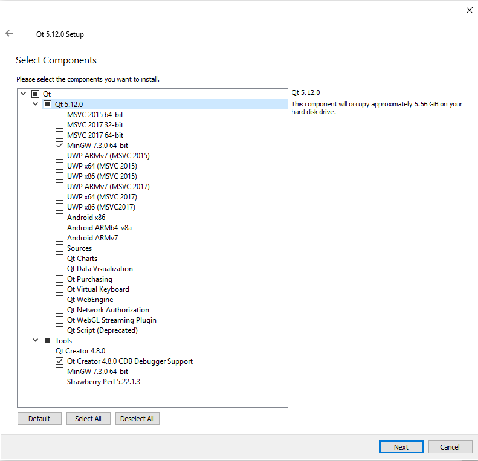
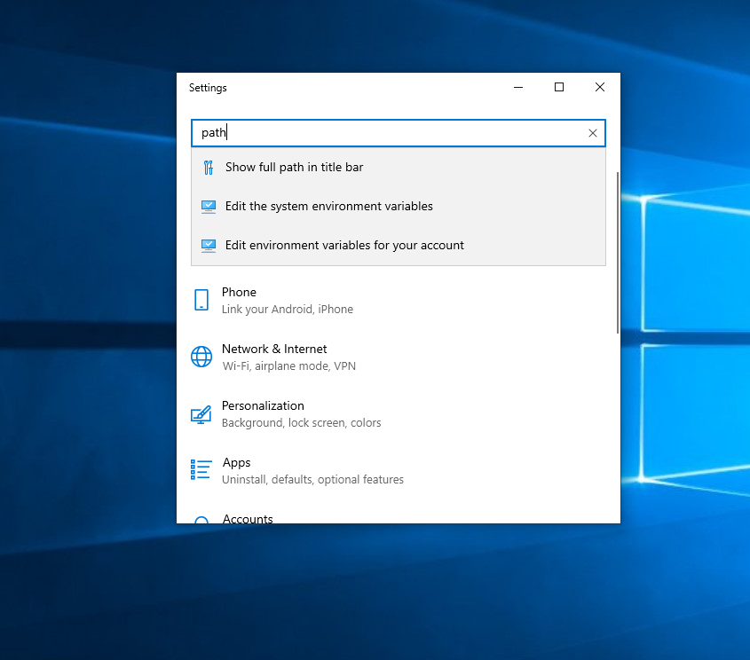
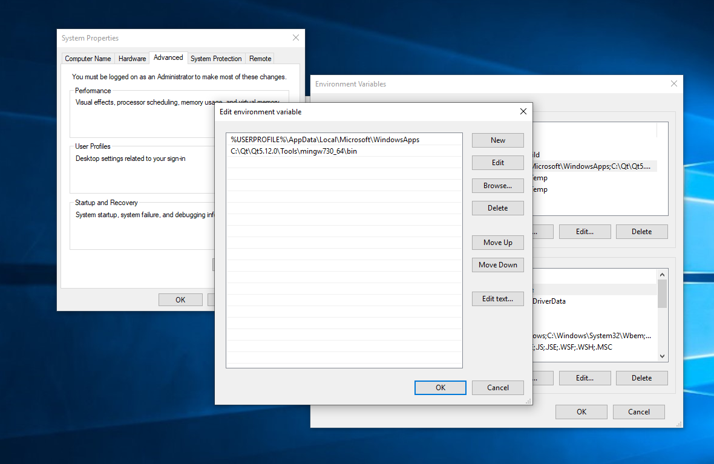
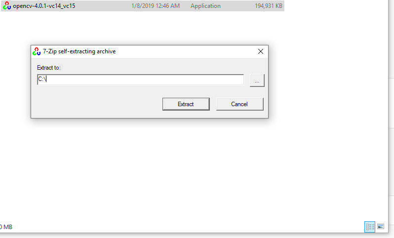

# Fast Track developer guide

[TOC]


## Introduction

FastTrack is developed to be used as a standalone application. I can also be embedded in existing C++/Qt projects or adapted to a specific project by re-implementing the existing software.

## Installation of the development environment

Each library can be compilated from source code, see https://wiki.qt.io/How_to_setup_Qt_and_openCV_on_Windows_with_MSVC2017, https://wiki.qt.io/Building_Qt_6_from_Git, etc...

Library prebuild can be found for Windows, macOS, and Windows to speed up the installation process.

### Windows

#### MSVC

The MSVC compiler can be installed as a part of [Visual Studio Community 2019](https://visualstudio.microsoft.com/vs/community/). During the installation process do not forget to select **Visual Studio Build Tools 2019** to install the build tools.


#### Qt installation

1. Go to https://download/qt.io/archive/qt and choose the last version of Qt>=6. Download the Window installer.

2. Follow the installation steps. On the Select Components page, select MSVC2019 64-bit.

   

3. Add Qt to the path:

   - Open the **Settings** dialogue.

     

   - Open the **Edit the system environment variables** and click on the **Environment Variables** button.

     

   - Double click on **Path** and add the Qt path: **C:\Qt\Qt6.1.2\Tools\msvc2019_64\bin** and the MSVC path **“C:\Program Files (x86)\Microsoft Visual Studio\2019\Community\VC\Tools\MSVC\14.24.28314\bin\Hostx64\x64”**

     

#### OpenCV installation

- Download the latest version of OpenCV at https://sourceforge.net/projects/opencvlibrary/files/ (in this example 4.0.1). Select the Windows file **opencv-4.0.1-vc14_vc15.exe**.

- Extract OpenCV in the **C:** folder.

  
- Add OpenCV to the path **C:\opencv_build\install\x86\vc15\bin**
- FastTrack can be compiled using 'qmake FastTrack.pro -spec win32-msvc "CONFIG+=qtquickcompiler"'' and then 'nmake'. Check that the version of the dll in the FastTrack.pro match the version of OpenCV.

### MacOs

- Install OpenCV 4 using `brew install opencv4`/
- Install QT6 using `brew install qt`.
- Compile FastTrack using `qmake6 FastTrack.pro` then `make`.

### Linux

- Install Qt6 and OpenCV4 using the package manager of our Linux distribution.
- Compile FastTrack using `qmake6 FastTrack.pro` then `make`.


## Tests

FastTrack uses [GoogleTest](https://google.github.io/googletest/) and [Pytest](https://docs.pytest.org/en/6.2.x/) to perform the unit and functional testing. The installation process can be found on these libraries' documentation.


## Adapt FastTrack for our project

To adapt FastTrack for our project, you must re-implement the **startProcess()** and **imageAnalysis()** virtual methods from the Tracking class with our image analysis workflow.

### startProcess() method

The **startProcess()** method initializes the tracking process by taking the first image of the sequence, detecting its format and all the objects in the image. 

By default the image analysis workflow is the following:

- Read image
- Binarize (optional)
- Thresholding
- Dilate (optional)
- The region of interest selection (optional)
- Object detection (detection + parameters extraction)
- Parameters saving.

The **startProcess()** method will emit a signal with the images to display and a signal to trigger the analysis of the rest of the image sequence.

### imageAnalysis() method

The **imageAnalysis()** method detects objects, extracts its parameters and associates objects to keep track of individual identity.

By default the image analysis workflow is the following:

- Read image
- Binarize (optional)
- Thresholding
- Dilate (optional)
- The region of interest selection (optional)
- Object detection (detection + parameters extraction)
- Objects association.
- Parameters saving.

The **imageAnalysis()** method will emit a signal with the image to display and trigger the analysis of the next image of the image sequence.


## Embedded Fast Track in our project

### Video tracking

To embed Fast Track in an existing project, you must first create a thread where the Tracking class will live.

```C++ 
thread = new QThread; // Creates a new QThread
tracking = new Tracking("path/to/folder/where/is/stored/the/image/sequence"); // Instantiates Tracking class
tracking -> moveToThread(thread); // Moves the Tracking instance in the new QThread

connect(thread, &QThread::started, tracking, &Tracking::startProcess); // Starts the tracking analysis when the thread start

// Do here all useful connect like updating parameters, display images, etc...

connect(tracking, &Tracking::finished, thread, &QThread::quit); // Shut down the thread when the tracking analysis is finished 
connect(tracking, &Tracking::finished, tracking, &Tracking::deleteLater); // Deletes the Tracking instance when the tracking analysis is finished
connect(thread, &QThread::finished, thread, &QThread::deleteLater); // Thread will be deleted only after it has fully shut down 
        
thread->start(); // Starts the tracking analysis
```

The tracking analysis will be running in the thread and destroy itself at the end.

### Real-time tracking

FastTrack supports live tracking analysis. Be sure to test the program on a video before to see if the analysis frame rate is lower or equal to the tracking analysis frame rate.

Create an acquisition image thread with an object Camera that sends a signal newImage(UMat) when a new image is available. 

```c++
thread = new QThread; // Creates a new QThread
tracking = new Tracking(""); // Instantiates Tracking class
tracking -> moveToThread(thread); // Moves the Tracking instance in the new QThread

connect(thread, &QThread::started, tracking, &Tracking::startProcess); // Starts the tracking analysis when the thread start

connect(camera, &Camera::newImage, tracking, &Tracking::receivedFrame);
// Do here all usefull connect like updating parameters, display images etc...

connect(tracking, &Tracking::finished, thread, &QThread::quit); // Shut down the thread when the tracking analysis is finished 
connect(tracking, &Tracking::finished, tracking, &Tracking::deleteLater); // Deletes the Tracking instance when the tracking analysis is finished
connect(thread, &QThread::finished, thread, &QThread::deleteLater); // Thread will be deleted only after it has fully shut down 
        
thread->start(); // Starts the tracking analysis
```


## Generate documentation

The documentation can be generated in HTML and PDF format with Doxygen. Install Doxygen and run

```
./generateDocumentation.sh
```

