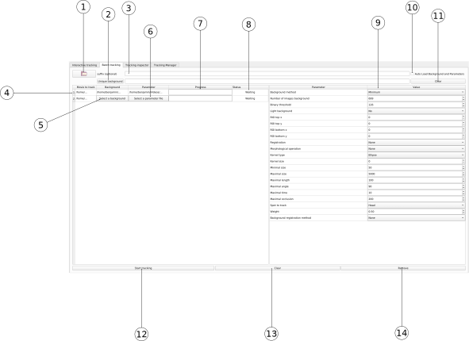

---

**NOTE**

The Batch Tracking panel is only accessible in Expert Mode (settings -> Expert Mode).

---

* 1: Open folder
* 2: Unique background
* 3: Suffix selection
* 4: Processing stack
* 5: Background selection
* 6: Parameter selection
* 7: Progress bar
* 8: Status
* 9: Parameters table
* 10: Autoload
* 11: Clear background
* 12: Start tracking
* 13: Clear stack
* 14: Remove from stack

The Batch Tracking panel is an advanced tool to track a large number of movies automatically. Several behaviors can be combined to load image sequences in a batch with specific background images or parameter files.

## Basic usage

The user can open several image sequences by clicking on the **Open folder** (1) button and select one or several folders. FastTrack can automatically load a background and/or a parameters file if a **Tracking_Result** folder is provided with the image sequence; check the **Autoload** (10) tick to activate this behavior.
After opening, image sequences are added to the **Processing stack** (4). If a background image and/or a set of parameters are automatically loaded, the path will be displayed in the second and third columns. If not, the user can select them with the (5) and (6) buttons after importation.
**By default**, if no background image and parameter file are selected, FastTrack will use the parameters provided in the Parameters table (9) **before** the image sequence importation.
The user can delete an image sequence by selecting the corresponding line in the **Processing stack** (4) and click on the **Remove** (14) button. The user can clear all the **Processing stack** (14) by clicking the **Clear** (13) button.
To process the stack, click the **Start Tracking** (12) button.

## More advanced options

### Add a suffix

The user can append a suffix to the imported folders *folder_path/ + suffix/*
For example, it can be usefull with a folder tree like this one:

- /myExperiment/Run1/images
- /myExperiment/Run2/images
- /myExperiment/Run3/images

The user can easily select in one time the folders:

- /myExperiment/Run1
- /myExperiment/Run2
- /myExperiment/Run3

And then add the suffix *images/* to select the desired folders without having to do it manually three times.

### Unique background image

The user can select a unique background image. Open an image with the **Unique background** (2) button, and **all the sequences in the stack** and sequences that will be imported will be using this background image. The user can use the **Clear** (12) to reset the default behavior.

### One parameter file
To apply the same parameters file to all the imported sequences:

Manual selection:

* Untick the **Autoload** (10).
* Select a set of parameters in the **Parameters table** (9).
* The sequences that will be imported will use this set of parameters.

With a file:

* Tick the **Autoload** (10)
* Load the sequence with the right parameters file.
* Untick the **Autoload** (10).
* The sequences that will be imported will use this set of parameters.

With a file:

* Untick the **Autoload** (10).
* Load a sequence.
* Select the parameter file with the (6) button.
* The sequences that will be imported will use this set of parameters.

## Behavior reminder

- (10) unticked, (2) not selected: FastTrack will use the parameters provided in the Parameters table (9) **before** the image sequence is added to the stack. It can be overwritten after importation with the (5) and (6) buttons.
- (10) ticked, (2) not selected: FastTrack will use the background and the parameters file in the Tracking_Result folder. If these files are missing, FastTrack will use the parameters provided in the Parameters table (9) **before** the image sequence is added to the stack.
- (10) ticked, (2) selected: the background selected in (2) will overwrite the automatically detected background.
- (3) selected: the image sequence path will be appended with the suffix, and default behavior will be applied with this path.
- (2) selected: select a unique background will overwrite all the existing background in the stack.
