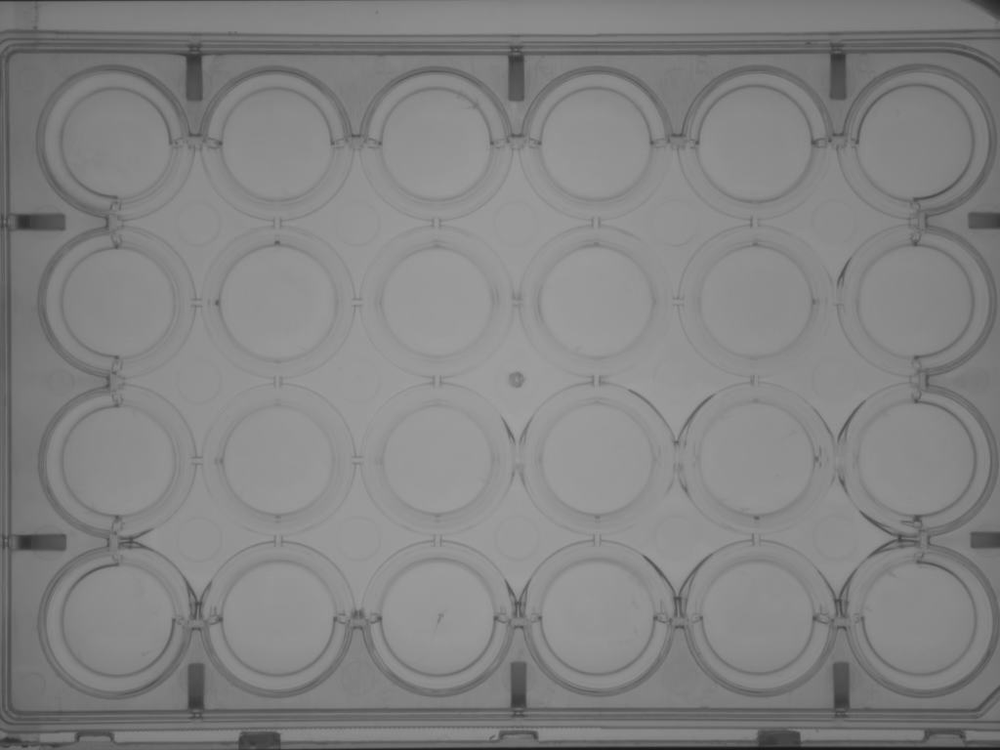
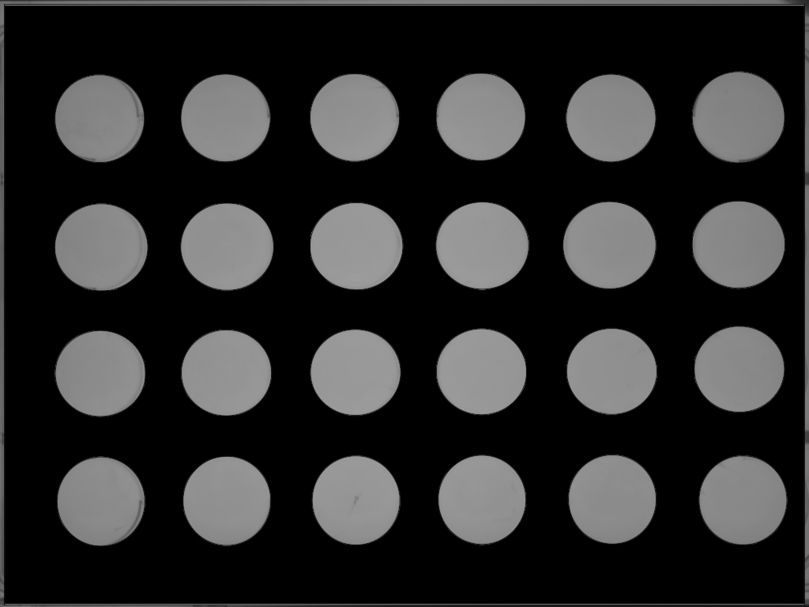
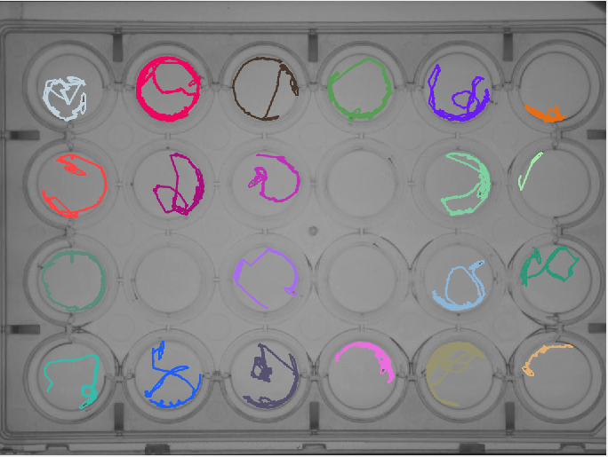

## Masking some regions

It is sometimes necessary to mask specific regions to avoid reflection or artifacts and enhanced detection. We will show a straightforward manner with the movie [ZFL_004]( http://data.ljp.upmc.fr/datasets/TD2/#ZFL_004) from the two-dimensional dataset.

1. Compute the background as usual. In this case, with will take the average.  
3. Construct a mask using [Gimp](https://www.gimp.org/) or [Inkscape](https://inkscape.org/) by taking the background image and masking irrelevant areas (in black or white, depending on the system).  
5. Load the new background image in FastTrack and performs the tracking.  
