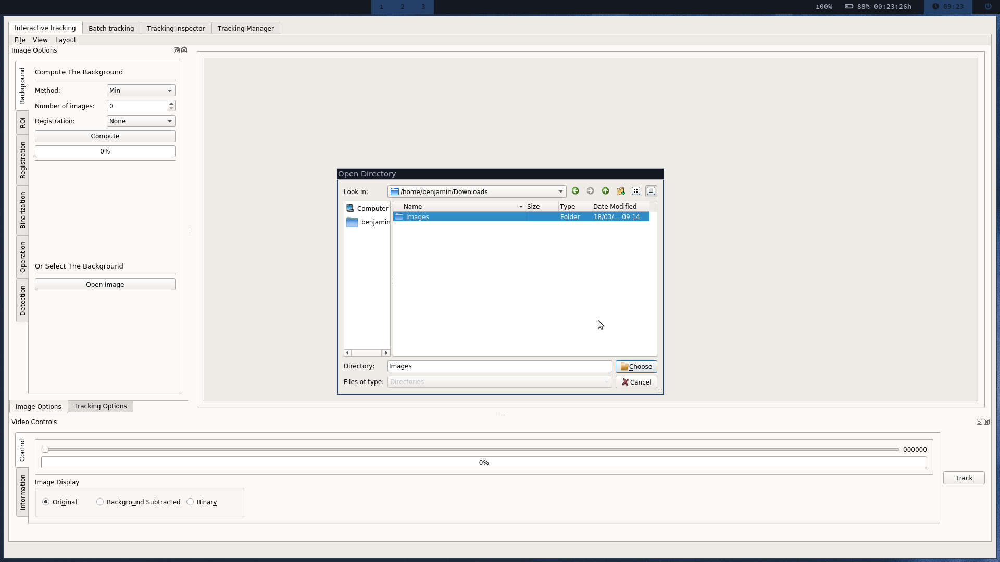
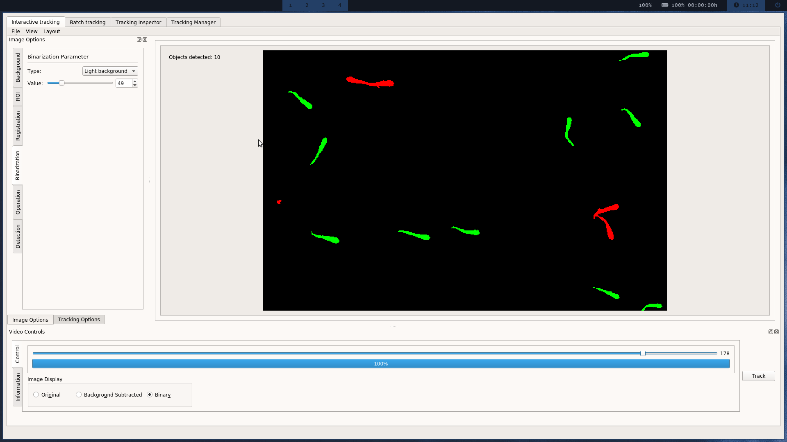
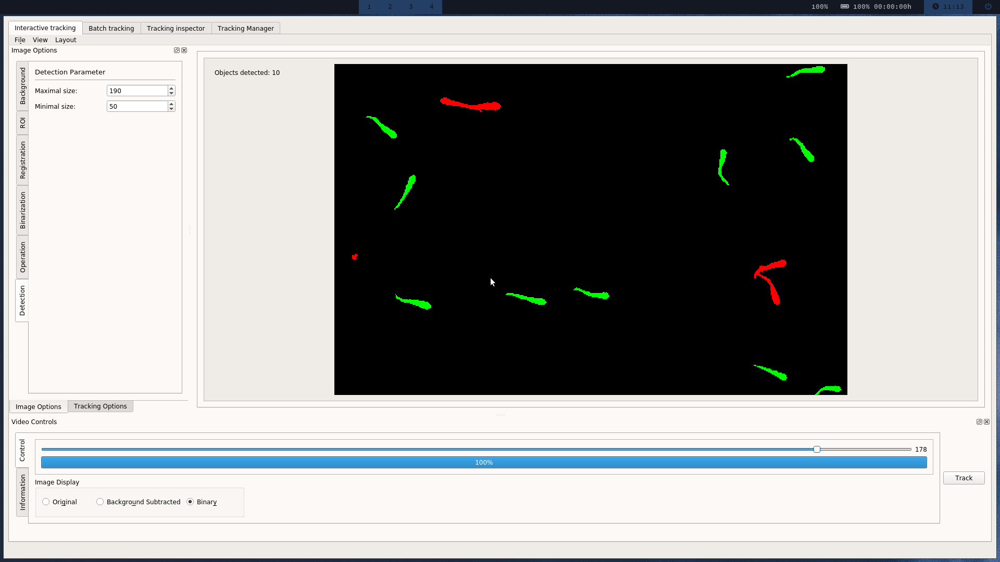

This section details step by step the process to test FastTrack using data from the [Two-Dimensional Tracking Dataset](http://data.ljp.upmc.fr/datasets/TD2/).

 <video width="100%" muted autoplay controls loop>
  <source src="/UserManual/docs/assets/example_vid.webm" type="video/webm">
Your browser does not support the video tag.
</video> 

### Downloading
In this example, we will use the challenging movie [ZFJ_001](http://data.ljp.upmc.fr/datasets/TD2/datasets/ZFJ_001/ZFJ_001.zip).
This movie features 14 very active juvenile zebrafish. The principal difficulty of this movie is the frequent and complex occlusions.
First, download the zip file and extract it. The image sequence is located inside the **images** folder.

### Tracking

1. Open **FastTrack** and select the **Interactive Tracking** panel. 
2. Import the movie by clicking on **File** then **Open an image sequence** and by selecting the folder **images** previously downloaded. 
3. Compute the background by clicking on the **Background** tab and selecting these parameters:
   * Method: **Max** (project the maximal intensity)
   * Number of images: **199** (all the images)
   * Registration: **None** (No registration is needed)
   
   And click the **Compute** button.
  4. Click the **Binarization** panel and select these parameters:
     * Type: **Light Background** (dark objects on light background)
     * Value: **49**
     
     
  
 5. Click on the **Detection** panel and select:
    * Maximal size: **190** (overlapping objects are rejected in most cases)
    * Minimal size: **50** (noise is rejected)
    
    
 6. Click the **Tracking Options** tab and select:
    * Normalization Distance: **50**
    * Normalization Angle: **10**
    * Maximal Distance: **75**
    * Maximal Time: **25**
    * Spot to track: **Head** (best for deformable asymetric objects)
    
    
   Note: these parameters were found by trials and errors.
7. Click on the **Track** button to start the tracking

## Reviewing

When the tracking is completed, FastTrack automatically opens the **Tracking Inspector** which allows the user to review and correct the tracking.

With the previous tracking analysis, only 7 corrections and 6 deletions are necessary to achieve a perfect tracking accuracy.

| image    | id    | delete    | swap with    |
| --- | --- | --- | --- |
| 17-20    | 1-0    | x    |     |
| 17-20    | 0    | x    |     |
| 22   | 0    |     | 1    |
| 23   | 1    |     | 4    |
| 27-28    | 1    | x    |     |
| 63    | 1    |     | 8    |
| 97    | 6    |     | 12    |
| 50-57    | 1    | x    |     |
| 109-121    | 0    | x    |     |
| 114    | 9    |     | 13    |
| 116-118    | 0    | x    |     |
| 122    | 0    |     | 13    |
| 124    | 4    |     | 12    |
