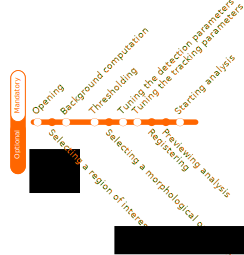

The Interactive panel serves as a platform for conducting tracking analysis and reviewing the results within an interactive environment. To achieve a successful tracking analysis, it is essential to follow a series of steps in the correct order. While some steps are mandatory, others are optional, allowing flexibility in the process. The provided workflow diagram (see above) illustrates the sequential flow of these steps, assisting users in efficiently navigating through the analysis.

## Opening a file

The first step of a tracking analysis is to open a video file. FastTrack supports both video files and image sequences. Click on the file or an image sequence to automatically load the movie.

## Computing the background

The background can be computed or imported. To compute the background, select a method and an image number. Images are selected from the image sequence at regular intervals, and three methods of computation by z-projection are available:

1. Min: Each pixel of the background image is the pixel with the minimal value across the selected images from the image sequence. This method is useful when the objects are light on a dark background.

2. Max: Each pixel of the background image is the pixel with the maximal value across the selected images from the image sequence. This method is useful when the objects are dark on a light background.

3. Average: Each pixel of the background image is the average of the pixels across the selected images from the image sequence.

The images can be registered before the z-projection. Three methods of registration are available.

## Selecting a region of interest (optional)

To select a region of interest, draw a rectangle  on the display with the mouse and click on the Crop button. Cancel the crop by clicking on the reset button.

## Computing the binary image

To generate the binary image from the background image and the image sequence, follow these steps: first, select the threshold value, and then observe the result on the display. The background type is automatically determined during the background computation process. However, it can be adjusted manually if needed: choose 'Dark Background' if the objects are light on a dark background, or select 'Light Background' if the objects are dark on a light background.

## Applying morphological operations (optional)

It is possible to apply a morphological operation to the binary image. Select a morphological operation, choose an appropriate kernel size and geometry, and then observe the result on the display. For more detailed information about the various operations, refer to the following link: https://docs.opencv.org/trunk/d9/d61/tutorial_py_morphological_ops.html.

## Tuning the detection parameters

Objects are detected based on their size. Choose the maximum and minimum size for the detected objects. The identified objects will be highlighted in green on the display, while the rejected objects will be shown in red.

## Tuning the tracking parameters

Several parameters can be modified to ensure a good tracking analysis. For more details, see [this page](http://www.fasttrack.sh/docs/trackingParameters/).

### Hard parameters

Hard parameters have to be set manually by the user:

- Maximal distance: If an object traveled more than this distance between two consecutive images, it would be considered a new object.
- Maximal time: The number of images an object is allowed to disappear. If an object reappears after this time, it will be considered a new object. If the number of objects is constant throughout the movie, set the Maximal Time equal to the movie's number of frames.
- Spot to track: This represents part of the object features used for tracking. Select the part that best reflects the direction of the object. Legacy parameters include 'head,' which corresponds to the smaller mid-part of the object, 'tail ellipse,' which corresponds to the wider mid-part of the object, and 'body,' which represents the full object.

### Soft parameters

The soft parameters can be automatically adjusted by clicking on the 'Level' button. This action computes the soft parameters, with each contribution weighing one quarter of the total cost (see more at [this page](https://journals.plos.org/ploscompbiol/article?id=10.1371/journal.pcbi.1008697#sec003) in the section 'automatic tracking parameters'). However, manual fine-tuning by the user is necessary to find the optimal soft parameters based on the system's knowledge. For example, if the objects' direction is not relevant in the system, the user can select the 'Normalization angle' equal to 0.

The soft parameters include:

- Normalization distance (legacy Maximal length/ Typical length): Represents the typical distance traveled between two consecutive images.
- Normalization angle (legacy Maximal angle/Typical angle): Represents the typical reorientation possible between two consecutive images.
- Normalization area: Represents the typical difference in area.
- Normalization perimeter: Represents the typical difference in perimeter.

## Registration

Image registration is the process of correcting small displacements and rotations of the camera during movie recording. FastTrack provides several methods for registering the movie:

* Phase correlation
* ECC image alignment
* Features-based

Please note that image registration is computationally intensive and can significantly decrease the speed of the program and the Replay tool will not use registered.

## Previewing the tracking

The tracking can be previewed on a sub-sequence of images. This feature can be useful for tuning parameters if the tracking is slow.

## Display options

Several display options are available and unlocked at each step of the analysis.

* Original: original image sequence
* Background subtracted: image sequence minus the background image.
* Binary: binary image sequence with detection overlays.
* Tracking: tracking data overlay.

## Layout options

Several layouts and themes are available in the layout menu in the top bar. Additionally, the user can build their own layout by dragging the option docks within the window.
[See a video demonstration](https://www.youtube.com/watch?v=grxAAX0J6CQ&feature=youtu.be)
