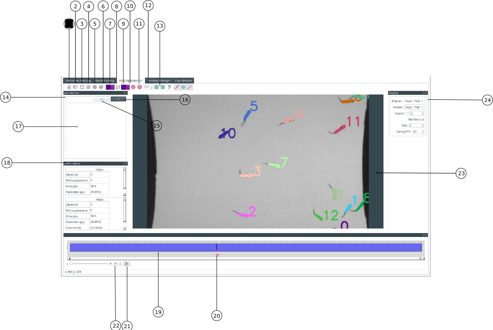

* 1: Open
* 2: Open Tracking_Result directory
* 3: Reload
* 4: Export video
* 5: Undo
* 6: Redo
* 8: First object selection box
* 9: Swap
* 9: Second object selection box
* 10: Delete one
* 11: Delete
* 12: Delete selection box
* 13: Previous/Next occlusion (experimental)
* 14: Annotation search
* 15: Annotation previous match
* 16: Annotation next match
* 17: Annotation entry
* 18: Objects information table
* 19: Timeline
* 20: Image number
* 21: Play
* 22: FPS selection box
* 23: Display
* 24: Overlay

**The Tracking Inspector** is a tool to display the result of a tracking analysis and to correct the tracking manually if necessary. For example, the user can delete an object to remove an artifact or change the object ID to correct a tracking error. To make the user's life easier, an ergonomic interface with build-in keyboard shortcuts are provided. FastTrack alleviates the tedious work of review and correction, and the user can achieve 100% tracking accuracy rapidly and efficiently.

## Load a tracking analysis
To load a tracking analysis previously tracked in FastTrack, first click on the **Open** button (1) and select a movie or an image of an image sequence. If the movie was tracked several times, the last tracking analysis is stored in the **Tracking_Result** folder and the previous tracking analysis in the **Tracking_Result_Date** folders and can be loaded using the **Open Tracking_result directory** button (2) (can only be activated if a movie is loaded).
Click on the **Reload)** button (3) to reload the tracking data if necessary.
The software can only load a tracking analysis if the folder architecture is preserved, .ie the folder with the image sequence has to have a sub-folder named **Tracking_Result** containing at least the *tracking.txt* file.

## Display options
Several tracking overlay options are available on the tracking overlay panel (24):

* Ellipse: display the head, tail, and or body ellipses on the tracked objects.
* Arrows: display an arrow on the head, tail, and or body of the tracked object indicating the orientation.
* Numbers: display the ids of the tracked objects.
* Traces: display the previous 50 positions of the tracked objects.
* Size: the size of the tracking overlay.
* Frame rate: display and saving frame rate.

Several useful information on the selected object can be found in the information table (18). The user can go to the image where the object has appeared for the first time by clicking directly on the table's corresponding cell.

## Inspect the tracking
The tracking can be inspected by moving the display cursor (19), see the image number (20), and automatically play the movie (21) at a selected frame rate (22).
Automatically detected occlusions (overlapped objects) can be reviewed by clicking on the **Previous** (12) and **Next** (13) occlusion buttons (this function is experimental and can miss some occlusions).

## Annotate the tracking
The user can annotate any image of the tracking. Write the annotation in the annotate text entry (17). The user can search across annotations with the find bar (14) and the buttons (15)(16). All the annotations are saved in the *annotation.txt* file in the **Tracking_Result** folder.

## Correct the tracking
### Swap the data of two objects
The user can correct an error by swapping two object's ID from the current image to the end of the sequence as follow:

* Left-click on the first object, the object ID and color are displayed on the first selection box (6).
* Left-click on the second object, the object ID and color are displayed on the second selection box (8)
* Right-click or click on the **Swap Button** (7) to exchange the ID of the two selected objects from the current image to the last image of the sequence.

### Delete the data of an object
To delete one object of several frames:

* Double left click on the object, the object ID and color are displayed on the second selection box (8).
* Select the number of frames on which to delete the object in the box (11). Shortcut C is available to focus on the selection box.
* Click on the **Delete** button (10) to delete the object from the current frame to the current frame plus the selected number.

To delete one object on the current frame:

* Double left-click on the object, the object ID and color are displayed on the second selection box (8).
* Click on the **Delete One** button (9) to delete the object on the current frame.

### Keyboard shortcuts summary
A set of keyboard shortcuts are available to speed-up the tracking correction.

- Q/A: go to the previous image.
- D: go to the next image.
- F: delete the selected object on the current image.
- C: enter the number of images where an object has to be deleted.
- G: delete an object from the current image to the current plus the selected number.

## Saving
All the changes made in the inspector are automatically saved in the original *tracking.txt* file. 

## Export a movie
To export a movie of a tracking analysis, select the desired display overlay and click on the **Save** button (3). Select a folder and a name to save the file. Only .avi format is supported.

Note: Movie with many objects by frame can be challenging to load and review in the tracking Inspector.

[See a video demonstration](https://youtu.be/5lhx-r_DHLY)
