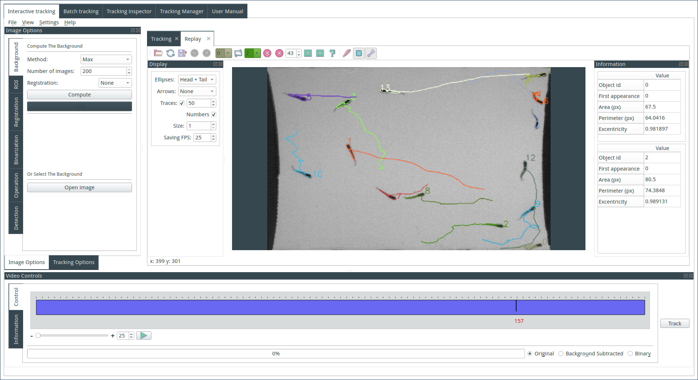

# FastTrack

      

## About

Tracking objects in video recording can be tedious. Existing software are expensive, the learning curve can be steep, necessitate a powerful computer, and the workflow can not be easily adapted when the project evolved.

**FastTrack** is a free (as freedom) desktop tracking software, easy to install, easy to use, and performant. The software can be downloaded for Linux, macOS, and Windows, and a public API is available to embed the core of the software in any C++/Qt project.

Two main features are implemented in the software:
* An automatic tracking algorithm that can detect and track objects (conserving the objects' identities across the video recording).
* A manual review of the tracking where errors can be corrected rapidly and easily to achieve 100% accuracy.

## Installation

Stable builds of the software are available for Linux, Mac, and Windows on the [download page](https://www.fasttrack.sh/docs/installation/). Nightly builds are available on the [Github Actions artifacts](https://github.com/FastTrackOrg/FastTrack/actions).

## Documentation

User documentation can be found [here](http://www.fasttrack.sh/UserManual/docs/intro.html) with video tutorials, examples, and an extended description of the software.
Developer documentation can be found [here](http://www.fasttrack.sh/API/index.html). It contains information to set up a development environment and the API of FastTrack.

## Examples

## Contributing

If you want to contribute to FastTrack, please follow the [guidelines](contributing.md). Any contribution or idea is welcome.

## Get help

If you need help, please contact benjamin.gallois@fasttrack.sh or open an issue on GitHub.

## Citation

You can cite FastTrack [Gallois, Benjamin, and Raphaël Candelier. "FastTrack: An open-source software for tracking varying numbers of deformable objects." PLoS computational biology 17.2 (2021): e1008697.](https://journals.plos.org/ploscompbiol/article?id=10.1371/journal.pcbi.1008697).
